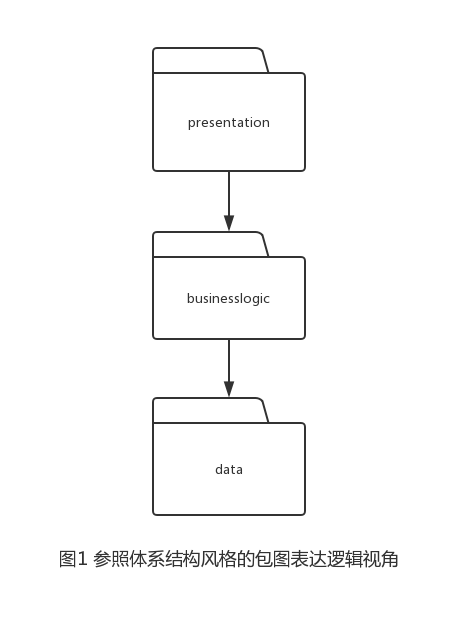
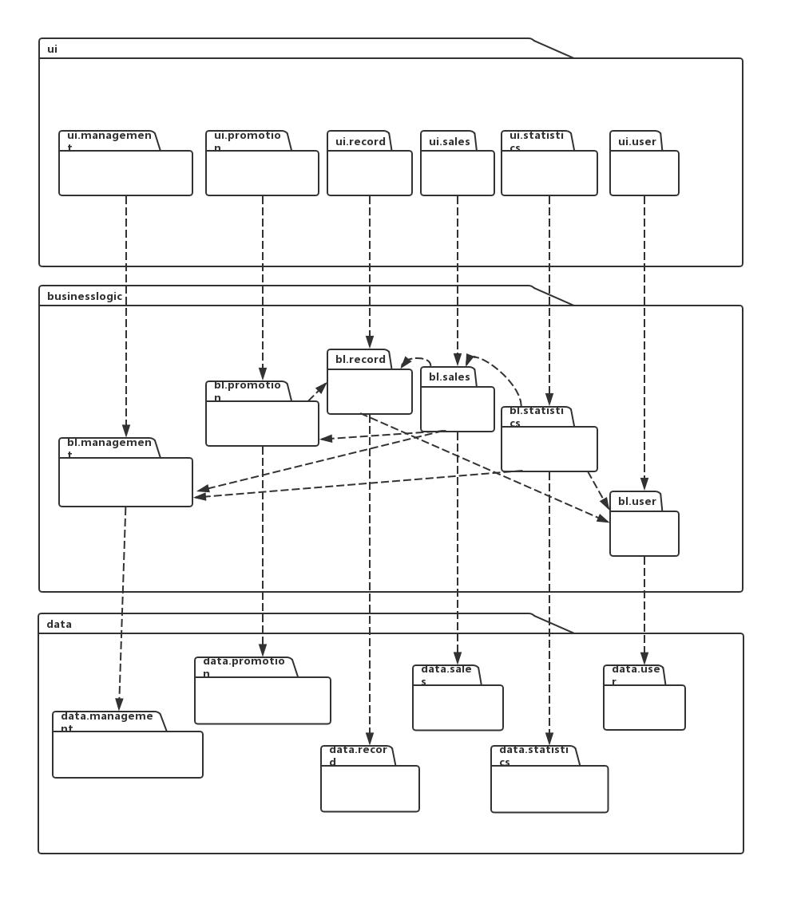
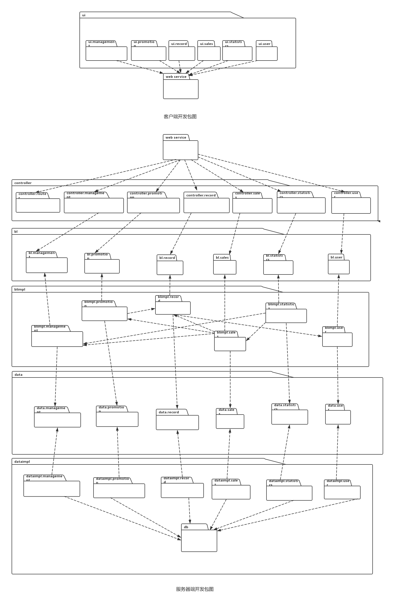
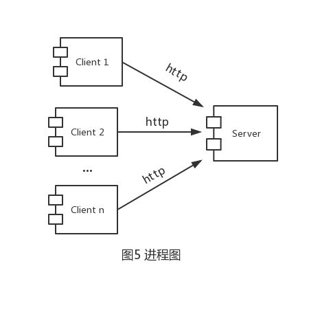
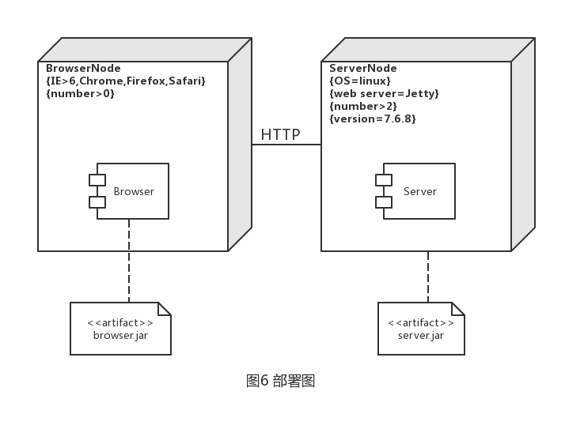
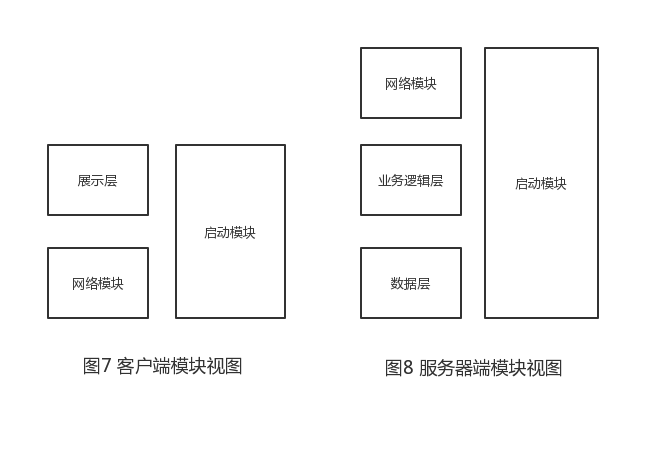
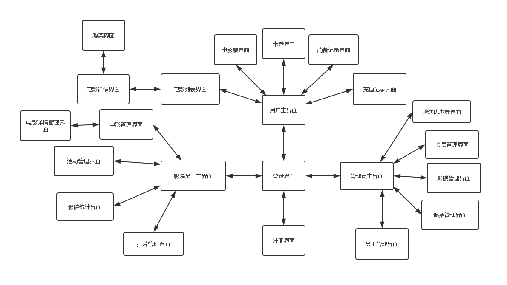
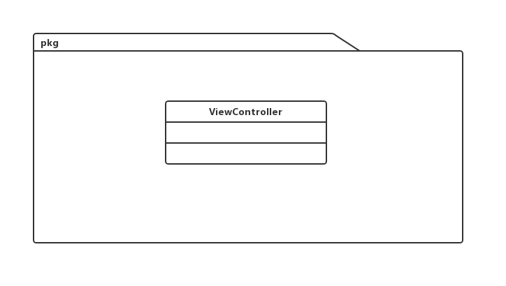

# 软件体系结构文档模板

## 文档修改历史

| 修改人员 | 日期      | 修改原因                 | 版本号 |
| :------: | --------- | ------------------------ | ------ |
|  翁溥鸿  | 2019.5.27 | 写入大体信息 | V0.9 |
| 全体成员 | 2019.5.28 | 全部的大致内容 | v1.0 |
|  翁溥鸿  | 2019.6.1 | 完成整理 | v1.1 |

## 目录

1.<a href="#1">引言</a>

2.<a href="#2">产品概述</a>

3.<a href="#3">逻辑视图</a>

4.<a href="#4">组合视图</a>

5.<a href="#5">架构设计</a>

6.<a href="#6">信息视角</a>


## 1.引言

### 1.1编制目的

本报告详细完成对电影院系统的概要设计，达到指导详细设计和开发的目的，同时实现和测试人员及用户的沟通。本报告面向开发人员、测试人员及最终用户而编写，是了解系统的导航。

### 1.2词汇表

| 词汇名称 | 词汇含义 | 备注 |
| :------: | -------- | ---- |
|    DTS    |     电子影院系统     |    无  |

### 1.3参考资料

1. <div id="123">电子影院系统用例文档 </div>

2. 电子影院系统软件需求规格说明文档 

   

## 2.<a id="2">产品概述</a>

一个用于电影院智能管理的系统，参考电子影院系统用例文档和电子影院系统软件需求规格说明文档中对产品的概括描述。 

## 3.逻辑视图

电子影院系统中，选择了分层体系结构风格，将系统分为 3 层（展示层、业务逻辑层、数据层）能够很好地示意整个高层抽象。展示层包含 GUI 页面的实现，业务逻辑层包含业务逻辑处理的实现，数据层负责数据的持久化和访问。分层体系结构的逻辑视角和逻辑设计方案如图所示。





## **4.组合视图**

### **4.1开发包图**

电子影院系统的最终开发包图设计如表1所示。

**表1 电子影院系统的最终开发包图设计**

| **开发包**            | **依赖的其他开发包**                                         |
| :-------------------- | ------------------------------------------------------------ |
| ui                    | ui.management、ui.promotion、ui.record、ui.sales、ui.statistics、ui.user |
| ui.management         | controller.router、controller.management、界面类库包         |
| ui.promotion          | controller.router、controller.promotion、界面类库包          |
| ui.record             | controller.router、controller.record、界面类库包             |
| ui.sales              | controller.router、controller.sales、界面类库包              |
| ui.statistics         | controller.router、controller.statistics、界面类库包         |
| ui.user               | controller.router、controller.user、界面类库包               |
| controller            | controller.router、controller.management、controller.promotion、controller.record、controller.sales、controller.statistics、controller.user |
| controller.router     |                                                              |
| controller.management | bl.management、vo                                            |
| controller.promotion  | bl.promotion、vo                                             |
| controller.record     | bl.record、vo                                                |
| controller.sales      | bl.sales、vo                                                 |
| controller.statistics | bl.statistics、vo                                            |
| controller.user       | bl.user、vo                                                  |
| bl                    | bl.management、bl.promotion、bl.record、bl.sales、bl.statistics、bl.user |
| bl.management         | data.management、vo、po                                      |
| bl.promotion          | data.promotion、vo、po                                       |
| bl.record             | data.record、vo、po、bl.user                                 |
| bl.sales              | salesdata、vo、po、bl.management、bl.promotion、bl.record    |
| bl.statistics         | statisticsdata、vo、po、bl.management、bl.user、bl.sales     |
| bl.user               | userdata、vo、po                                             |
| data.management       | po                                                           |
| data.promotion        | po                                                           |
| data.record           | po                                                           |
| data.sales            | po                                                           |
| data.statistics       | po                                                           |
| data.user             | po                                                           |
| po                    |                                                              |
| vo                    |                                                              |
| db                    |                                                              |

电子影院系统客户端开发包图，服务器端开发包图如图所示。



### 4.2运行时进程

在电子影院管理系统中，会有多个客户端进程和一个服务器端进程，其进程图如图5所示。结合部署图，客户端进程是在客户机浏览器上运行，服务器端进程在服务器端机器上运行。




### 4.3物理部署

电子影院系统采用B/S结构（Browser/Server，浏览器/服务器模式），客户机上只要安装一个浏览器（Browser），如Netscape Navigator或Internet Explorer，服务器安装SQL Server、Oracle、MYSQL等数据库。浏览器通过Web Server 同数据库进行数据交互。



## 5.架构设计

### 5.1模块职责

客户端模块和服务器端模块视图分别如图7和图8所示。浏览器各层和服务器端各层的职责分别如表2和表3所示。



**表2 客户端各层的职责**

| 层       | 职责                                 |
| :------- | :----------------------------------- |
| 启动模块 | 负责初始化网络通信机制，启动用户界面 |
| 展示层   | 基于窗口的电子影院浏览器端用户界面   |
| 网络模块 | 利用http协议查找Web服务              |

**表3 服务器端各层的职责**

| 层         | 职责                                         |
| ---------- | -------------------------------------------- |
| 启动模块   | 负责初始化网络通信机制，启动用户界面         |
| 网络模块   | 利用http协议查找Web服务                      |
| 业务逻辑层 | 对于用户界面的输入进行响应并进行业务处理逻辑 |
| 数据层     | 负责数据的持久化及数据访问接口               |

每一层只是使用下方直接接触的层。层与层之间仅仅是通过接口的调用来完成的。层之间的接口如表4所示。

**表4 层之间的接口调用**

| 接口                  | 服务调用方       | 服务提供方       |
| :-------------------- | :--------------- | :--------------- |
| HallController        | 客户端展示层     | 服务端业务逻辑层 |
| MovieController       |                  |                  |
| ScheduleController    |                  |                  |
| ActivityController    |                  |                  |
| CouponController      |                  |                  |
| VIPCardController     |                  |                  |
| ConsumptionController |                  |                  |
| RechargeController    |                  |                  |
| TicketController      |                  |                  |
| StatisticsController  |                  |                  |
| AccountController     |                  |                  |
| ViewController        |                  |                  |
| HallMapper            | 服务端业务逻辑层 | 服务端数据层     |
| MovieMapper           |                  |                  |
| ScheduleMapper        |                  |                  |
| ActivityMapper        |                  |                  |
| CouponMapper          |                  |                  |
| VIPCardMapper         |                  |                  |
| VIPInfoMapper         |                  |                  |
| ConsumptionMapper     |                  |                  |
| RechargeMapper        |                  |                  |
| TicketMapper          |                  |                  |
| WithdrawMapper        |                  |                  |
| MovieLikeMapper       |                  |                  |
| StatisticsMapper      |                  |                  |
| AccountMapper         |                  |                  |

### 5.2用户界面层分解

#### 5.2.1用户界面层模块的职责

根据需求，系统存在20个用户界面：登录界面，注册界面，用户主界面，电影列表界面，电影详情界面，购票界面，电影票界面，卡券界面，消费记录界面，充值记录界面，电影管理界面，电影详情界面，活动管理界面，影院统计界面，排片管理界面，影院管理界面，会员管理界面，退票管理界面，员工管理界面，赠送优惠券界面。界面跳转如下图所示。



##### 5.2.1.1类图



#### 5.2.2 用户界面层模块的职责

下表为用户界面层模块的职责

| 模块           | 职责                                       |
| -------------- | ------------------------------------------ |
| ViewController | 界面Controller，负责界面的显示和界面的跳转 |

#### 5.2.3 用户界面层模块的接口规范

用户界面层模块的接口规范如下表所示

|                                           | 语法     | public String getIndex()                   |
| ----------------------------------------- | -------- | ------------------------------------------ |
| ViewController.getIndex                   | 前置条件 | url="/index"                               |
|                                           | 后置条件 | 显示登录界面                               |
|                                           | 语法     | public String getSignUp()                  |
| ViewController.getSignUp                  | 前置条件 | url="/signUp"                              |
|                                           | 后置条件 | 显示注册界面                               |
|                                           | 语法     | public String getAdminVIPInfoManage()      |
| ViewController.getAdminVIPInfoManage      | 前置条件 | url="/admin/vipInfo/manage"                |
|                                           | 后置条件 | 显示会员管理界面                           |
|                                           | 语法     | public String getTicketSellerMovieManage() |
| ViewController.getTicketSellerMovieManage | 前置条件 | url="/ticketSeller/movie/manage"           |
|                                           | 后置条件 | 显示电影管理界面                           |
|                                           | 语法     | public String getUserHome()                |
| ViewController.getUserHome                | 前置条件 | url="/user/home"                           |
|                                           | 后置条件 | 显示用户主页                               |
| ...                                       | ...      | ...                                        |


#### 5.2.3 用户界面模块设计原理

用户界面利用Java的SpingRoot框架和Html，JavaScript来实现。

### 5.3业务逻辑层分解

#### 5.3.1职责

| 模块                  | 职责                                     |
| --------------------- | ---------------------------------------- |
| bl.promotion.activity | 负责实现影院优惠活动功能所需要的服务     |
| bl.promotion.coupon   | 负责实现影院优惠券功能所需要的服务       |
| bl.promotion.VIP      | 负责实现影院会员卡功能所需要的服务       |
| bl.record             | 负责实现记录影院用户消费和充值记录的服务 |
| bl.manage.hall        | 负责实现记录影院影厅的服务               |

#### 5.3.2接口规范
##### 5.3.2.1 bl.promotion.coupon模块的接口规范如下表所示。
| 提供的服务（供接口） |          |                                                              |
| -------------------- | -------- | ------------------------------------------------------------ |
|                      | 语法     | ResponseVO getCouponsByUser(int userId)                |
| CouponService.getCouponsByUser                        | 前置条件 | 用户权限等级为影院员工                                 |
|                      | 后置条件 | 系统根据用户id查找并返回优惠券                         |
|                      | 语法     | ResponseVO addCoupon(CouponForm couponForm)            |
| CouponService.addCoupon                         | 前置条件 | 用户权限等级为影院员工，优惠券格式输入正确             |
|                      | 后置条件 | 系统新增一个优惠券信息                                 |
| | 语法                                       | ResponseVO issueCoupon(int couponId,int userId)        |
| CouponService.issueCoupon                       | 前置条件                                   | 用户权限等级为影院员工                                 |
| | 后置条件                                   | 系统新增一个用户持有优惠券的信息                       |
| | 语法                                       | ResponseVO getAllCoupon()                              |
| CouponService.getAllCoupon                      | 前置条件                                   | 用户权限等级为影院员工                                                |
| | 后置条件                                   | 系统返回所有优惠券的列表                                |
| | 语法                                       | ResponseVO sendCoupons(int[] usersId, int[] couponsId) |
| CouponService.sendCoupons                       | 前置条件                                   | 用户权限等级为管理员                                                |
| | 后置条件                                   | 系统新增多个用户持有优惠券的信息                        |

| **需要的服务（需接口）**                                |                                     |
| -------------------- | -------- |
| CouponMapper.insertCoupon(Coupon coupon)               | 插入Coupon单一持久化对象 |
| CouponMapper.insertCouponUser(int couponId,int userId) | 插入CouponUser单一持久化对象 |
| CouponMapper.selectCouponByUser(int userId)            | 根据userId查找多个Coupon持久化对象 |
| CouponMapper.selectCoupons()                           | 查找所有Coupon持久化对象             |
| CouponMapper.selectById(int id)                        | 根据优惠券id查找Coupon持久化对象 |
| CouponMapper.deleteCouponUser(int couponId,int userId) | 根据用户名和电影名删除CouponUser持久化对象 |
##### 5.3.2.2 bl.promotion.VIP 模块的接口规范如下表所示。


| **提供的服务（供接口）**    |          |                                                 |
| --------------------------- | -------- | ----------------------------------------------- |
|                             | 语法     | ResponseVO addVIPCard(int userId,int vipInfoId) |
| VIPService.addVIPCard       | 前置条件 | 用户未购买会员卡                                |
|                             | 后置条件 | 系统增加用户购买持有会员卡的信息                |
|                             | 语法     | ResponseVO getVIPInfoByName(String name)        |
| VIPService.getVIPInfoByName | 前置条件 | 用户未购买会员卡                                |
|                             | 后置条件 | 系统返回用户想要查看的会员卡种类的信息          |
|                             | 语法     | ResponseVO getVIPInfoById(int ID)               |
| VIPService.getVIPInfoById   | 前置条件 | 用户已购买会员卡                                |
|                             | 后置条件 | 系统返回用户拥有的会员卡种类信息                |
|                             | 语法     | ResponseVO getCardById(int id)                  |
| VIPService.getCardById      | 前置条件 | 无                                              |
|                             | 后置条件 | 系统根据会员卡id返回所查询会员卡的信息          |
|                             | 语法     | ResponseVO charge(VIPCardForm vipCardForm)      |
| VIPService.charge           | 前置条件 | 用户未购买会员卡                                |
|                             | 后置条件 | 系统更新用户会员卡的余额                        |
|                             | 语法     | ResponseVO getCardByUserId(int userId)          |
| VIPService.getCardByUserId  | 前置条件 | 无                                              |
|                             | 后置条件 | 系统根据用户id返回所查询会员卡信息              |
|                             | 语法     | ResponseVO addVIPInfo(VIPInfoVO vipInfoVO)      |
| VIPService.addVIPInfo       | 前置条件 | 用户权限等级为管理员                            |
|                             | 后置条件 | 系统增加会员卡种类信息                          |
|                             | 语法     | ResponseVO getAllVIPInfo()                      |
| VIPService.getAllVIPInfo    | 前置条件 | 用户权限等级为管理员                            |
|                             | 后置条件 | 系统返回所有会员卡种类信息                      |
|                             | 语法     | ResponseVO updateVIPInfo(VIPInfoVO vipInfoVO)   |
| VIPService.updateVIPInfo    | 前置条件 | 用户权限等级为管理员                            |
|                             | 后置条件 | 系统更新会员卡种类信息                          |

| 需要的服务（需接口）                                   |                                     |
| ------------------------------------------------------ | ----------------------------------- |
| VIPCardMapper.insertOneCard(VIPCard vipCard)           | 插入VIPCard单一持久化对象           |
| VIPCardMapper.selectCardById(int id)                   | 根据id查找VIPCard单一持久化对象     |
| VIPCardMapper.updateCardBalance(int id,double balance) | 更新VIPCard单一持久化对象的余额     |
| VIPCardMapper.selectCardByUserId(int userId)           | 根据用户ID查找VIPCard单一持久化对象 |
| VIPInfoMapper.insertVIPInfo(VIPInfo vipInfo)           | 插入VIPInfo单一持久化对象           |
| VIPInfoMapper.selectALLVIPInfo()                       | 查找所有VIPInfo持久化对象           |
| VIPInfoMapper.selectVIPInfoByName(String name)         | 根据名字查找VIPInfo单一持久化对象   |
| VIPInfoMapper.selectVIPInfoById(int id)                | 根据id查找VIPInfo单一持久化对象     |
| VIPInfoMapper.updateVIPInfo(VIPInfo vipInfo)           | 更新VIPInfo单一持久化对象           |
| RechargeServiceForBl.recordRecharge(RechargeVO rechargevo)   | 更新Recharge单一持久化对象          |
| ConsumptionServiceForBl.recordRecharge(ConsumptionVO consumptionVO) | 更新Consumption单一持久化对象       |

##### 5.3.2.3 bl.record模块的接口规范如下表所示

| 提供的服务（供接口）                            |          |                                                          |
| ----------------------------------------------- | -------- | -------------------------------------------------------- |
|                                                 | 语法     | ResponseVO recordRecharge(ConsumptionVO vo));            |
| ConsumptionService.recordRecharge               | 前置条件 | 用户完成消费                                             |
|                                                 | 后置条件 | 将vo持久化对象存入数据库                                 |
|                                                 | 语法     | ResponseVO getConsumtions(String userId);                |
| ConsumptionService.getConsumtions               | 前置条件 | 用户已登陆                                               |
|                                                 | 后置条件 | 获得user的消费记录                                       |
|                                                 | 语法     | ResponseVO getConsumtionsOrderByBalance(double balance); |
| ConsumptionService.getConsumtionsOrderByBalance | 前置条件 | 用户作为管理员登陆，且balance为正数                      |
|                                                 | 后置条件 | 返回符合条件的消费信息                                   |
|                                                 | 语法     | ResponseVO getConsumtionsOrder();                        |
| ConsumptionService.getConsumtionsOrderByBalance | 前置条件 | 用户作为管理员登陆                                       |
|                                                 | 后置条件 | 返回符合条件的消费信息                                   |
|                                                 | 语法     | public ResponseVO getRechargesByID(String userId);       |
| RechargeService.getRechargesByID                | 前置条件 | 用户已登陆                                               |
|                                                 | 后置条件 | 获得充值信息                                             |
|                                                 | 语法     | public ResponseVO recordRecharge(RechargeVO vo);         |
| RechargeService.recordRecharge                  | 前置条件 | 用户充值成功                                             |
|                                                 | 后置条件 | recharge被存入数据库                                     |
|                                                 |          |                                                          |


| 需要的服务（需接口）                                       |                               |
| ---------------------------------------------------------- | ----------------------------- |
| 服务名                                                     | 服务                          |
| ConsumptionMapper.selectConsumptions(String userId)        | 在数据库中获得consumption对象 |
| ConsumptionMapper.insertCOnsumptionInfor(ConsumptionVO vo) | 插入单一持久化对象            |
| ...                                                        | ...                           |

##### 5.3.2.4 bl.hall模块的接口规范如下表所示。
| 提供的服务（供接口）      |          |                                                       |
| ------------------------- | -------- | ----------------------------------------------------- |
|                           | 语法     | public ResponseVO serchAllHall()                      |
| HallService.searchAllHall | 前置条件 | 存在影厅                                              |
|                           | 后置条件 | 返回所有影厅列表                                      |
|                           | 语法     | public ResponseVO addHall(HallForm addHallForm)       |
| HallService.addHall       | 前置条件 | addHallForm符合输入要求                               |
|                           | 后置条件 | 添加新的影厅信息                                      |
|                           | 语法     | public ResponseVO updateHall(HallForm updateHallForm) |
| HallService.updateHall    | 前置条件 | updateHallForm符合输入要并该影厅不在使用中求          |
|                           | 后置条件 | 修改当前影厅信息                                      |
|                           | 语法     | public ResponseVO deleteHall(Integer hallId)          |
| HallService.deleteHall    | 前置条件 | id存在并该影厅不在使用中                              |
|                           | 后置条件 | 删除该影厅信息                                        |

| **需要的服务（需接口）**                       |                                              |
| ---------------------------------------------- | -------------------------------------------- |
| HallMapper.selectAllHall()                     | 返回所有HallPO对象                           |
| HallMapper.selectHalllById(Integer hallId)     | 根据ID查找HallPO单一持久化对象               |
| HallMapper.insertOneHall(HallForm addHallForm) | 根据添加信息HallForm插入HallPO单一持久化对象 |
| HallMapper.updateHall(HallForm updateHallForm) | 更新HallPO单一持久化对象                     |
| HallMapper.deleteHallById(Integer HallId)      | 根据ID删除HallPO单一持久化对象               |
##### 5.3.2.5 bl.sales.Ticket 模块的接口规范如下表所示
| 提供的服务（供接口）             |          |                                                              |
| -------------------------------- | -------- | ------------------------------------------------------------ |
|                                  | 语法     | public ResponseVO withdrawTicket(int ticketId);              |
| TicketService.withdrawTicket     | 前置条件 | 用户点击退票                                                 |
|                                  | 后置条件 | 更新数据库信息将票的状态变为失效，并退还部分金额至用户账户   |
|                                  | 语法     | public ResponseVO getAllWithdrawInfo();                      |
| TicketService.getAllWithdrawInfo | 前置条件 | 用户以管理员身份登录                                         |
|                                  | 后置条件 | 返回所有退票信息列表                                         |
|                                  | 语法     | public ResponseVO addWithdrawInfo(withdrawInfoForm withdrawInfoForm); |
| TicketService.addWithdrawInfo    | 前置条件 | withdrawInfoForm 内容有效                                    |
|                                  | 后置条件 | 将withdrawInfo持久化对象存入数据库                           |
|                                  | 语法     | public ResponseVO updateWithdrawInfo(withdrawInfoForm withdrawInfoForm); |
| TicketService.updateWithdrawInfo | 前置条件 | withdrawInfoForm 内容有效                                    |
|                                  | 后置条件 | 将withdrawInfo持久化对象更新数据库                           |
|                                  | 语法     | public ResponseVO deleteWithdrawInfo(int scheduleId);        |
| TicketService.deleteWithdrawInfo | 前置条件 | 该schedule存在                                               |
|                                  | 后置条件 | 从数据库中删除对应的持久化对象                               |

| 需要的服务（需接口）                                         |                                |
| ------------------------------------------------------------ | ------------------------------ |
| 服务名                                                       | 服务                           |
| WithdrawMapper.insertWithdrawInfo(withdrawInfoForm withdrawInfoForm) | 在数据库中插入withdrawInfo对象 |
| WithdrawMapper.updateWithdrawInfo(withdrawInfoForm withdrawInfoForm) | 更新单一持久化对象             |
| WithdrawMapper.deleteWithdrawInfo(int scheduleId)            | 删除单一持久化对象             |
| WithdrawMapper.selectWithdrawInfoByScheduleId(int scheduleId) | 根据电影场次查找withdrawInfo   |
| WithdrawMapper.selectAllWithdrawInfo()                       | 获得所有单一持久化对象         |
| ScheduleServiceForBl.getScheduleItemById(int id)             | 根据id查找schedule对象         |
| HallServiceForBl.getHallById(int id)                         | 根据id查找Hall对象             |
| CouponServiceForBl.selectCouponByUser(int userId)            | 根据用户查找Coupon对象         |
| CouponServiceForBl.selectCouponById(int id)                  | 根据id查找Coupon对象           |
| CouponServiceForBl.deleteCouponUser(int couponId,int userId) | 删除单一持久化对象             |
| CouponServiceForBl.insertCouponUser(int couponId,int userId) | 插入单一持久化对象             |
| VIPServiceForBl.selectCardByUserId(int userId)               | 根据用户查找VIPcard对象        |
| VIPServiceForBl.updateCardBalance(int cardId,double balance) | 更新单一持久化对象             |
| ActivityServiceForBl.selectActivities()                      | 获取所有单一持久化对象         |
| ActivityServiceForBl.selectActivitiesByMovie(int movieId)    | 根据电影查找Activity对象       |
| ConsumptionService.recordRecharge(ConsumptionVO vo)          | 插入单一持久化对象             |

##### 5.3.2.6 bl.user.Admin 模块的接口规范如下表所示

| 提供的服务（供接口）           |          |                                                          |
| ------------------------------ | -------- | -------------------------------------------------------- |
|                                | 语法     | public ResponseVO getAllUser();                          |
| AdminService.getAllUser        | 前置条件 | 无                                                       |
|                                | 后置条件 | 返回所有用户信息                                         |
|                                | 语法     | public ResponseVO getUserById(int userId);               |
| AdminService.getUserById       | 前置条件 | 用户存在                                                 |
|                                | 后置条件 | 返回用户User对象                                         |
|                                | 语法     | public ResponseVO getUserByUserName(String username);    |
| AdminService.getUserByUserName | 前置条件 | 用户存在                                                 |
|                                | 后置条件 | 返回用户User对象                                         |
|                                | 语法     | public ResponseVO updateUser(UserVO userVO);             |
| AdminService.updateUser        | 前置条件 | userVO 内容有效                                          |
|                                | 后置条件 | 持久化更新user对象                                       |
|                                | 语法     | public ResponseVO updateUserLevel(int userId,int level); |
| AdminService.updateUserLevel   | 前置条件 | 用户存在，输入合法                                       |
|                                | 后置条件 | 持久化更新user信息                                       |
|                                | 语法     | public ResponseVO deleteUser(int userId);                |
| AdminService.deleteUser        | 前置条件 | 用户存在                                                 |
|                                | 后置条件 | 删除用户信息                                             |
|                                | 语法     | public ResponseVO addUser(UserVO userVO);                |
| AdminService.addUser           | 前置条件 | userVO 内容有效                                          |
|                                | 后置条件 | 将user持久化存入数据库                                   |
|                                | 语法     | public ResponseVO registerAccount(UserForm userForm);    |
| AccountService.registerAccount | 前置条件 | userForm内容有效                                         |
|                                | 后置条件 | 注册账号                                                 |
|                                | 语法     | public UserVO login(UserForm userForm);                  |
| AccountService.login           | 前置条件 | userForm内容有效                                         |
|                                | 后置条件 | 用户登录，登录成功会将用户信息保存再session中            |

| 需要的服务（需接口）                                         |                        |
| ------------------------------------------------------------ | ---------------------- |
| 服务名                                                       | 服务                   |
| AccountMapper.createNewAccount(String username, String password) | 在数据库中新建一个账号 |
| AccountMapper.getAccountByName(String username)              | 根据用户名查找账号     |
| AccountMapper.getAccountById(int id)                         | 根据id查找User对象     |
| AccountMapper.updateUser(User user)                          | 更新单一持久化对象     |
| AccountMapper.updateUserLevel(int userId,int level)          | 更新单一持久化对象     |
| AccountMapper.getAllUser()                                   | 获得所有单一持久化对象 |
| AccountMapper.addUser(String username,String password,int level) | 插入单一持久化对象     |
| AccountMapper,deleteUser(int userId)                         | 删除单一持久化对象     |

### 5.4数据层分解

#### 5.4.1职责

| 模块              | 职责                                                         |
| ----------------- | ------------------------------------------------------------ |
| ActivityMapper    | 基于序列化文件的持久化数据的接口，提供 Activity 的集体载入、 集体保存、增、删、改、查服务 |
| CouponMapper      | 基于序列化文件的持久化数据的接口，提供 Coupon 的集体载入、 集体保存、增、删、改、查服务 |
| VIPCardMapper     | 基于序列化文件的持久化数据的接口，提供 VIPCard 的集体载入、 集体保存、增、删、改、查服务 |
| VIPInfoMapper     | 基于序列化文件的持久化数据的接口，提供 VIPInfo 的集体载入、 集体保存、增、删、改、查服务 |
| ConsumptionMapper | 基于序列化文件的持久化数据的接口，提供 Consumption 的集体载入、 集体保存、增、删、改、查服务 |
| RechargeMapper    | 基于序列化文件的持久化数据的接口，提供 Recharge 的集体载入、 集体保存、增、删、改、查服务 |
| HallMapper        | 基于序列化文件的持久化数据的接口，提供 Hall 的集体载入、 集体保存、增、删、改、查服务 |

#### 5.4.2接口规范
##### 5.4.2.1CouponMapper模块的接口规范如下表所示
| 提供的服务（供接口）    |          |                                   |
| ----------------------- | -------- | --------------------------------- |
|                         | 语法     | int insertCoupon(Coupon coupon)                |
| CouponMapper.insertCoupon       | 前置条件 | 无                                             |
|                         | 后置条件 | 插入一个po                                     |
|                         | 语法     | List<Coupon> selectCoupons()                   |
| CouponMapper.selectCoupons      | 前置条件 | 无                                |
|                         | 后置条件 | 返回多个po                                     |
|                         | 语法     | List<Coupon> selectCouponByUser(int userId)    |
| CouponMapper.selectCouponByUser | 前置条件 | 数据库中存在同样userId的po |
|                         | 后置条件 | 返回多个po                                     |
|                         | 语法     | Coupon selectById(int id)                      |
| CouponMapper.selectById | 前置条件 | 在数据库中存在同样id的po        |
|                         | 后置条件 | 返回一个po                        |
|                         | 语法     | void insertCouponUser(int couponId,int userId) |
| CouponMapper.insertCouponUser   | 前置条件 | 数据库中不存在同样的po           |
|                         | 后置条件 | 插入一个po                                     |
|                         | 语法     | void deleteCouponUser(int couponId,int userId) |
| CouponMapper.deleteCouponUser   | 前置条件 | 数据库存在一个相同的po                    |
|                         | 后置条件 | 删除一个po            |
##### 5.4.2.2 VIPCardMapper模块的接口规范如下表所示

| 提供的服务（供接口）             |          |                                               |
| -------------------------------- | -------- | --------------------------------------------- |
|                                  | 语法     | int insertOneCard(VIPCard vipCard)            |
| VIPCardMapper.insertOneCard      | 前置条件 | 数据库没有相同的po                            |
|                                  | 后置条件 | 插入一个po                                    |
|                                  | 语法     | VIPCard selectCardById(int id)                |
| VIPCardMapper.selectCardById     | 前置条件 | 数据库中存在id相同的po                        |
|                                  | 后置条件 | 返回一个po                                    |
|                                  | 语法     | void updateCardBalance(int id,double balance) |
| VIPCardMapper.updateCardBalance  | 前置条件 | 在数据库中存在同样id的po                      |
|                                  | 后置条件 | 更新一个po                                    |
|                                  | 语法     | VIPCard selectCardByUserId(int userId)        |
| VIPCardMapper.selectCardByUserId | 前置条件 | 数据库中存在同样userId的po                    |
|                                  | 后置条件 | 返回一个po                                    |

##### 5.4.2.3 VIPInfoMapper模块的接口规范如下表所示

| 提供的服务（供接口）              |          |                                          |
| --------------------------------- | -------- | ---------------------------------------- |
|                                   | 语法     | int insertVIPInfo(VIPInfo vipInfo)       |
| VIPInfoMapper.insertVIPInfo       | 前置条件 | 数据库没有相同的po                       |
|                                   | 后置条件 | 插入一个po                               |
|                                   | 语法     | List<VIPInfo> selectALLVIPInfo()         |
| VIPInfoMapper.selectALLVIPInfo    | 前置条件 | 无                                       |
|                                   | 后置条件 | 返回多个po                               |
|                                   | 语法     | VIPInfo selectVIPInfoByName(String name) |
| VIPInfoMapper.selectVIPInfoByName | 前置条件 | 数据库中存在同样name的po                 |
|                                   | 后置条件 | 返回一个po                               |
|                                   | 语法     | VIPInfo selectVIPInfoById(int id)        |
| VIPInfoMapper.selectVIPInfoById   | 前置条件 | 数据库中存在同样id的po                   |
|                                   | 后置条件 | 返回一个po                               |
|                                   | 语法     | void updateVIPInfo(VIPInfo vipInfo)      |
| VIPInfoMapper.updateVIPInfo       | 前置条件 | 数据库中存在同样id的po                   |
|                                   | 后置条件 | 更新一个po                               |

##### 5.4.2.4 ConsumptionMapper 模块的接口规范如下表所

| 提供的服务（供接口）                        |          |                                                             |
| ------------------------------------------- | -------- | ----------------------------------------------------------- |
|                                             | 语法     | List<Consumption> selectConsumptions(String userId);        |
| ConsumptionMapper.selectConsumptions        | 前置条件 | 无                                                          |
|                                             | 后置条件 | 返回相应结果                                                |
|                                             | 语法     | int insertCOnsumptionInfor(ConsumptionVO vo)                |
| ConsumptionMapper.insertCOnsumptionInfor    | 前置条件 | 无                                                          |
|                                             | 后置条件 | 返回结果                                                    |
|                                             | 语法     | List<Consumption> selectConsumptionsByOrder(double balance) |
| ConsumptionMapper.selectConsumptionsByOrder | 前置条件 | 无                                                          |
|                                             | 后置条件 | 返回符合条件结果                                            |
|                                             | 语法     | List<Consumption> getAllConsumptions();                     |
| ConsumptionMapper.getAllConsumptions        | 前置条件 | 无                                                          |
|                                             | 后置条件 | 返回符合条件结果                                            |
##### 5.4.2.5 RechargeMapper 模块的接口规范如下表所示

| 提供的服务（供接口）               |          |                                                |
| ---------------------------------- | -------- | ---------------------------------------------- |
|                                    | 语法     | List<Recharge> selectRecharges(String userId); |
| RechargeMapper.selectRecharges     | 前置条件 | 已登录                                         |
|                                    | 后置条件 | 返回对应记录                                   |
|                                    | 语法     | int insertRechargeInfor(RechargeVO vo)         |
| RechargeMapper.insertRechargeInfor | 前置条件 | 充值成功                                       |
|                                    | 后置条件 | 返回受影响行数                                 |

##### 5.4.2.6 HallMapper模块的接口规范如下表所示
| 提供的服务（供接口）       |          |                                                       |
| -------------------------- | -------- | ----------------------------------------------------- |
|                            | 语法     | Public ResponseVO addHall(HallForm addHallForm)       |
| HallMapper.addHall         | 前置条件 | 用户提交的影厅信息合法                                |
|                            | 后置条件 | 系统返回新的影厅列表                                  |
|                            | 语法     | Public ResponseVO updateHall(HallForm updateHallForm) |
| HallMapper.updateHall      | 前置条件 | 用户点击修改，并且提交的新影厅信息合法                |
|                            | 后置条件 | 系统返回新的影厅列表                                  |
|                            | 语法     | Public ResponseVO searchAllHall()                     |
| HallMapper.searchAllHall   | 前置条件 | 用户进入影厅页面                                      |
|                            | 后置条件 | 系统返回影厅列表                                      |
|                            | 语法     | Public ResponseVO deleteHall()                        |
| HallMapper.deleteHall      | 前置条件 | 用户点击删除按键                                      |
|                            | 后置条件 | 系统返回新的影厅列表                                  |

##### 5.4.2.7 TicketMapper 模块的接口规范如下表所示

| 提供的服务（供接口）                 |          |                                                              |
| ------------------------------------ | -------- | ------------------------------------------------------------ |
|                                      | 语法     | public int insertTicket(Ticket ticket);                      |
| TicketMapper.insertTicket            | 前置条件 | 无                                                           |
|                                      | 后置条件 | 在数据库中增加一个ticket记录                                 |
|                                      | 语法     | public void updateTicketState(int ticketId, int state);      |
| TicketMapper.updateTicketState       | 前置条件 | 数据库中存在同样Id的ticket记录                               |
|                                      | 后置条件 | 更新ticket记录                                               |
|                                      | 语法     | public List<Ticket> selectTicketsBySchedule(int scheduleId); |
| TicketMapper.selectTicketsBySchedule | 前置条件 | 数据库中存在相同ScheduleId的ticket记录                       |
|                                      | 后置条件 | 查找返回相应的ticket结果                                     |
|                                      | 语法     | public Ticket selectTicketById(int id);                      |
| TicketMapper.selectTicketById        | 前置条件 | 数据库中存在同样Id的ticket记录                               |
|                                      | 后置条件 | 按Id进行查找返回相应的ticket结果                             |
|                                      | 语法     | public List<Ticket> selectTicketByUser(int userId);          |
| TicketMapper.selectTicketByUser      | 前置条件 | 数据库中存在相同UserId的ticket记录                           |
|                                      | 后置条件 | 查找返回相应的ticket结果                                     |
|                                      | 语法     | public void cleanExpiredTicket();                            |
| TicketMapper.cleanExpiredTicket      | 前置条件 | 购票时间过后15min没有付款                                    |
|                                      | 后置条件 | 将满足条件的ticket状态变为已失效                             |

##### 5.4.2.8 WithdrawMapper 模块的接口规范如下表所示

| 提供的服务（供接口）                          |          |                                                              |
| --------------------------------------------- | -------- | ------------------------------------------------------------ |
|                                               | 语法     | public int insertWithdrawInfo(withdrawInfoForm withdrawInfoForm); |
| WithdrawMapper.insertWithdrawInfo             | 前置条件 | 同样Id的withdrawInfo在数据库中不存在                         |
|                                               | 后置条件 | 在数据库中增加一个withdrawInfo记录                           |
|                                               | 语法     | public int updateWithdrawInfo(withdrawInfoForm withdrawInfoForm); |
| WithdrawMapper.updateWithdrawInfo             | 前置条件 | 在数据库中存在相同Id的withdrawInfo记录                       |
|                                               | 后置条件 | 更新一个withdrawInfo                                         |
|                                               | 语法     | public int deleteWithdrawInfo(int scheduleId);               |
| WithdrawMapper.deleteWithdrawInfo             | 前置条件 | 数据库中存在同样Id的withdrawInfo                             |
|                                               | 后置条件 | 更新一个withdrawInfo                                         |
|                                               | 语法     | public WithdrawInfo selectWithdrawInfoByScheduleId(int scheduleId); |
| WithdrawMapper.selectWithdrawInfoByScheduleId | 前置条件 | 无                                                           |
|                                               | 后置条件 | 按ScheduleId查找返回相应的withdrawInfo                       |
|                                               | 语法     | public List<WithdrawInfo> selectAllWithdrawInfo();           |
| WithdrawMapper.selectAllWithdrawInfo          | 前置条件 | 无                                                           |
|                                               | 后置条件 | 返回所有的withdrawInfo对象                                   |

##### 5.4.2.9 AccountMapper 模块的接口规范如下表所示

| 提供的服务（供接口）           |          |                                                              |
| ------------------------------ | -------- | ------------------------------------------------------------ |
|                                | 语法     | public int createNewAccount(String username,String password); |
| AccountMapper.createNewAccount | 前置条件 | 无                                                           |
|                                | 后置条件 | 在数据库中增加一个po                                         |
|                                | 语法     | public User getAccountByName(String username);               |
| AccountMapper.getAccountByName | 前置条件 | 无                                                           |
|                                | 后置条件 | 按username进行查找返回相应的user对象                         |
|                                | 语法     | public User getAccountById(int id);                          |
| AccountMapper.getAccountById   | 前置条件 | 无                                                           |
|                                | 后置条件 | 按id进行查找返回相应的user对象                               |
|                                | 语法     | public int updateUser(User user);                            |
| AccountMapper.updateUser       | 前置条件 | 数据库中存在相同id的po                                       |
|                                | 后置条件 | 更新一个po                                                   |
|                                | 语法     | public int updateUserLevel(int userId,int level);            |
| AccountMapper.updateUserLevel  | 前置条件 | 数据库中存在相同id的po                                       |
|                                | 后置条件 | 更新一个po                                                   |
|                                | 语法     | public ArrayList<User> getAllUser();                         |
| AccountMapper.getAllUser       | 前置条件 | 无                                                           |
|                                | 后置条件 | 返回数据库中所有的user对象                                   |
|                                | 语法     | public int addUser(String username,String password,int level); |
| AccountMapper.addUser          | 前置条件 | 无                                                           |
|                                | 后置条件 | 在数据库中添加一个po                                         |
|                                | 语法     | public int deleteUser(int userId);                           |
| AccountMapper,deleteUser       | 前置条件 | 数据库中存在相同id的po                                       |
|                                | 后置条件 | 删除一个po                                                   |
### 6.信息视角

#### 6.1描述数据持久化对象(PO)

- Activity 类包含优惠活动id、优惠活动名称、优惠活动描述、优惠活动开始时间、优惠活动截止时间、优惠电影列表、优惠券规格属性。

- AudiencePrice 类包含用户id、总价格属性。

- Consumption 类包裹用户id、价格、支付方式、支付时间属性。

- Coupon 类包括优惠券id、优惠券描述、优惠券名称、使用门槛、优惠金额、可用时间、失效时间属性。

- DataLike 类包括喜爱人数、喜欢时间属性。

- Hall 类包括影厅id、影厅名称、行数、列数属性。

- Movie。 类包含电影id、电影名称、电影宣传海报url、导演、编剧、主演、类型、制片国家/地区、语言、上映日期、片长、描述、电影状态、是否想看、想看人数属性。

- MovieScheduleTime 类包含电影id、排片次数、排片名称属性。

- MovieTotalBoxOffice 类包含电影id、票房、名称属性。

- Recharge 类包含充值价格、充值 时间属性。

- ScheduleItem 类包含排片id、影厅id、影厅名称、电影id、电影名、开始放映时间、结束放映时间、票价属性。

- Ticket 类包含电影票id、用户id、排片id、列号、行号、订单状态、订票时间属性。

- User 类包含用户的用户名、密码、权限等级属性。

- UserTotalConsumption 类包含用户名、付款金额、用户id属性。

- VIPCard 类包含会员卡id、VIP信息id、用户id、会员卡余额、办卡日期属性。

- VIPInfo 类包含会员卡信息id、会员卡简介、会员卡价格、最低消费额度、优惠额度属性。

- WithdrawInfo 类退票id、退票说明、退票截至时间、排片id、退票折扣属性。

  持久化对象如 UserPO 的定义如以下代码所示。

  ```java
ublic class WithdrawInfo {
  
      private int id;
  
      private String withdrawDescription;
  
      private Date closeTime;
  
      private int scheduleId;
  
      private double discount;
  ublic class VIPInfo {
  private int id;
  	
  	/**
  	 * 会员卡简介
  	 */
      private String description;
      
      /**
       * 会员卡名称
       */
      private String name;
  
      /**
       * 会员卡价格
       */
      private double price;
      
      /**
       * 最低消费额度
       */
      private double minimumCharge;
      
      /**
       * 优惠额度
       */
      private double extraCharge;
  
      public VIPInfo(VIPInfoVO v) {
      	this.description = v.getDescription();
      	this.price = v.getPrice();
      	this.extraCharge = v.getExtraCharge();
      	this.name = v.getName();
      	this.minimumCharge = v.getMinimumCharge();
      	this.id = v.getId();
  		// TODO Auto-generated constructor stub
  	}
  
  	public VIPInfo() {
  	}
  
  	public String getDescription() {
          return description;
      }
  
      public void setDescription(String description) {
          this.description = description;
      }
  
      public double getPrice() {
          return price;
      }
  
      public void setPrice(double price) {
          this.price = price;
      }
      
    public void setExtraCharge(double extraCharge) {
  		this.extraCharge = extraCharge;
  	}
      
      public double getExtraCharge() {
  		return extraCharge;
  	}
      
      public void setMinimumCharge(double minimumCharge) {
  		this.minimumCharge = minimumCharge;
  	}
      
      public double getMinimumCharge() {
  		return minimumCharge;
  	}
      
      public void setId(int id) {
  		this.id = id;
  	}
      
      public int getId() {
  		return id;
  	}
      
      public void setName(String name) {
  		this.name = name;
  	}
      
      public String getName() {
  		return name;
  	}
      
      public VIPInfoVO getVO(){
      	VIPInfoVO v = new VIPInfoVO();
      	v.setDescription(this.description);
      	v.setExtraCharge(this.extraCharge);
      	v.setId(this.id);
      	v.setMinimumCharge(this.minimumCharge);
      	v.setName(this.name);
      	v.setPrice(this.price);
      	return v;
      }
  }
      public double getDiscount() {
          return discount;
      }
  
      public void setDiscount(double discount) {
          this.discount = discount;
      }
  
      public String getWithdrawDescription() {
          return withdrawDescription;
      }
  
      public void setWithdrawDescription(String withdrawDescription) {
          this.withdrawDescription = withdrawDescription;
      }
  
      public Date getCloseTime() {
          return closeTime;
      }
  
      public void setCloseTime(Date closeTime) {
          this.closeTime = closeTime;
      }
  
      public int getScheduleId() {
          return scheduleId;
      }
  
      public void setScheduleId(int scheduleId) {
          this.scheduleId = scheduleId;
      }
  
      public int getId() {
          return id;
      }
  
      public void setId(int id) {
          this.id = id;
      }
  }
  ```
  
  
